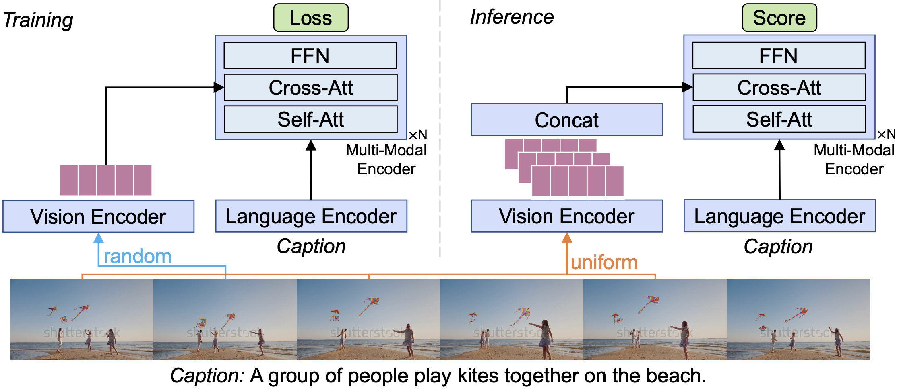
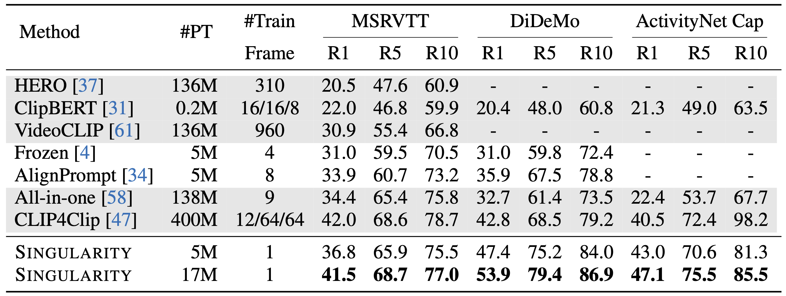
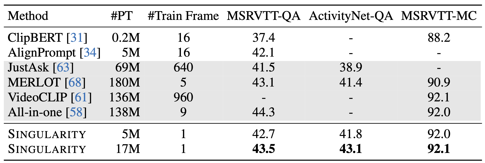

# Singularity

[Revealing Single Frame Bias for Video-and-Language Learning](https://arxiv.org/abs/2206.03428), arXiv 2022

[Jie Lei](http://www.cs.unc.edu/~jielei/), [Tamara L. Berg](http://tamaraberg.com/), [Mohit Bansal](http://www.cs.unc.edu/~mbansal/)


Official PyTorch code for Singularity, an efficient single-frame approach for end-to-end learning on video-text tasks. It adopts a single-frame training, and multi-frame inference strategy for efficient and accurate learning on a set of video-text tasks. It also shows competitive performance on image-text tasks. Supported tasks are:
* text-to-video retrieval on MSRVTT, DiDeMo, ActivityNet Captions
* video question answering on MSRVTT-MC, MSRVTT-QA, ActivityNet-QA
* text-to-image retrieval on COCO, Flickr
* image question answering on VQA

Besides, based on the action recognition dataset [SSV2](https://arxiv.org/abs/1706.04261), we also provide **two new video-and-language tasks that requires fine-grained temporal modeling**. These two retrieval tasks are also supported by this repo.

<p align="center">

</p>


## Setup


The specific packages used in our experiment are detailed in [environment.yaml](environment.yaml), you can easily create a conda env containing these packages.
```bash
# create 
conda env create -f environment.yaml
# activate
conda activate sl
```

In your .bashrc file, set the environment variables:
```bash
export SL_EXP_DIR="/path/to/ckpts_and_logs"
export SL_DATA_DIR="/path/to/data"
```
These variables are accessed by the yaml files in the [configs/](configs) directory and the shell scripts in [scripts/](scripts).

[Optional] Our codebase support using [wandb](https://wandb.ai/) to monitor training. If you want to use wandb, you will need to set up it following [this very short instruction](https://docs.wandb.ai/quickstart#1.-set-up-wandb), and also set `wandb.enable` in the [configs](configs) to be `True`.


## Download
#### Annotations
* [Pre-training data](https://vision.cs.unc.edu/jielei/project/sparse_bwd_data/release/anno_pretrain.tar.gz), 2.6 GB.
* [Downstream data](https://vision.cs.unc.edu/jielei/project/sparse_bwd_data/release/anno_downstream.tar.gz), 0.6 GB, including **the new ssv2 tasks**.

It is recommended to save the annotation files under `${SL_DATA_DIR}`. For example, the config file [configs/pretrain.yaml](configs/pretrain.yaml) assume `${SL_DATA_DIR}/anno_pretrain` is the directory containing all pre-training annotation files. Detailed statistics of these datasets are provided in our paper.

#### Checkpoints (size 1.6 GB - 4.0 GB)
* [Pre-trained checkpoints](https://vision.cs.unc.edu/jielei/project/sparse_bwd_data/release/ckpts/pt.tar.gz)
* [Fine-tuned checkpoints, MSRVTT retrieval](https://vision.cs.unc.edu/jielei/project/sparse_bwd_data/release/ckpts/msrvtt_ret.tar.gz)
* [Fine-tuned checkpoints, DiDeMo retrieval](https://vision.cs.unc.edu/jielei/project/sparse_bwd_data/release/ckpts/didemo_ret.tar.gz)
* [Fine-tuned checkpoints, ActivityNet Captions retrieval](https://vision.cs.unc.edu/jielei/project/sparse_bwd_data/release/ckpts/anet_ret.tar.gz)
* [Fine-tuned checkpoints, SSV2 label retrieval](https://vision.cs.unc.edu/jielei/project/sparse_bwd_data/release/ckpts/ssv2l_ret.tar.gz)
* [Fine-tuned checkpoints, SSV2 template retrieval](https://vision.cs.unc.edu/jielei/project/sparse_bwd_data/release/ckpts/ssv2t_ret.tar.gz)
* [Fine-tuned checkpoints, MSRVTT QA](https://vision.cs.unc.edu/jielei/project/sparse_bwd_data/release/ckpts/msrvtt_qa.tar.gz)
* [Fine-tuned checkpoints, ActivityNet QA](https://vision.cs.unc.edu/jielei/project/sparse_bwd_data/release/ckpts/anet_qa.tar.gz)
* [Fine-tuned checkpoints, COCO retrieval](https://vision.cs.unc.edu/jielei/project/sparse_bwd_data/release/ckpts/coco_ret.tar.gz)
* [Fine-tuned checkpoints, Flickr retrieval](https://vision.cs.unc.edu/jielei/project/sparse_bwd_data/release/ckpts/flickr_ret.tar.gz)
* [Fine-tuned checkpoints, VQA](https://vision.cs.unc.edu/jielei/project/sparse_bwd_data/release/ckpts/vqa.tar.gz)

For video-text tasks, each `.tar.gz` file includes both Singularity (1-frame) and Singularity-temporal (4-frame) models, pre-trained on 5M and 17M corpus, in total 4 ckeckpoints per file. For image-text tasks, each `.tar.gz` file contains two Singularity ckeckpoints per file.

#### Raw Videos and Images
We compile the resources and links for downloading and preprocessing (e.g., compressing for faster loading, etc.) the raw videos and images for all the datasets used in this work, in [DATA.md](DATA.md)


## Pre-Training
Launch pre-training with the following command:
```bash
bash scripts/pretrain.sh EXP_NAME CORPUS NGPU local 
```
`EXP_NAME` indicates the name of the current run. `CORPUS` is the name of the dataset used for training, check [configs/pretrain.yaml](configs/pretrain.yaml) for available corpus. `NGPU` is the number of GPUs to use. The last parameter `local` specifies the program will be running on a local machine, instead of a slurm managed cluster. For training on WebVid and CC3M datasets, with 3 GPUs, run
```bash
bash scripts/pretrain.sh first_run webvid_cc3m 3 local
```
With 3 A100 GPUs, this pre-training takes about 1 day to finish.
You can also change the other configs in [configs/pretrain.yaml](configs/pretrain.yaml). For example, you can append `wandb.enable=True` to enable logging with wandb:
```bash
bash scripts/pretrain.sh first_run webvid_cc3m 3 local wandb.enable=True
```
If you are using slurm, simply replace `bash` with `sbatch`, and `local` with `slurm`:
```bash
sbatch scripts/pretrain.sh first_run webvid_cc3m 3 slurm wandb.enable=True
```
However, note that you may need to change `#SBATCH` configs in [scripts/pretrain.sh](scripts/pretrain.sh) for your specific slurm cluster, e.g., `--partition`. Also, the `NGPU` argument will be ignored, you need to specify #gpus using `#SBATCH` in the script.


Some useful scripts:

* Pre-training on 5M corpus:
    ```bash
    bash scripts/pretrain.sh 5m_1frm_pt webvid_cc3m 3 local
    ```

* Pre-training on 17M corpus:
    ```bash
    bash scripts/pretrain.sh 17m_1frm_pt webvid_14m 3 local
    ```
  
* 2nd stage video pre-training on WebVid:
    ```bash
    bash scripts/pretrain.sh 2nd_4frm_pt webvid 3 local \
      pretrained_path=SINGLE_FRM_PT_CKPT_PATH \
      optimizer.lr=5e-5 scheduler.epochs=5 \
      video_input.num_frames=4 batch_size.video=32 \
      add_temporal_embed=True 
      temporal_vision_encoder.enable=True \
      temporal_vision_encoder.num_layers=2
    ```


## Pre-Training on custom data
It is quite simple and straightforward to pre-train or fine-tune on your own data. Below we give step-by-step instructions for pre-training on your own image-text or video-text dataset. 

#### 1. Format annotation file 
The annotation file is in `json` format, which can be loaded as a list of dictionaries. Each dictionary is `{'image': path_to_image, 'caption': image_caption}` for image-text dataset, and is `{'image': path_to_video, 'caption': video_caption}` for video-text dataset. Note that we use the same key `image` for both image-text and video-text datasets for simplicity.

#### 2. Modify config file
In [configs/pretrain.yaml](configs/pretrain.yaml), add name and paths to your annotation file under the `available_corpus` entry. For example `my_new_dataset: [path_to_json, path_to_image_directory]`. For video-text datasets, add an indicator `video` in this configuration list: `my_new_dataset: [path_to_json, path_to_video_directory, video]`

#### 3. Modify training script
In [scripts/pretrain.sh](scripts/pretrain.sh), add `&& [[ ${corpus} != "my_new_dataset" ]]` in the if clause. 


#### 4. Launch training
The script below trains the single frame Singularity model on the custom dataset named `my_new_dataset` on 3 local GPUs. The experiment is named `my_new_dataset_1frm_pt`.
```bash
bash scripts/pretrain.sh my_new_dataset_1frm_pt my_new_dataset 3 local
```


## Fine-Tuning
### Retrieval
Launch fine-tuning for text-to-video (or text-to-image) retrieval with the following command:
```bash
bash scripts/train_ret.sh EXP_NAME DATASET NGPU local \
 pretrained_path=PT_CKPT_PATH
```
`EXP_NAME` is the name of the training. `DATASET` indicates the dataset to use, it can be one of `[msrvtt, didemo, anet, ssv2_label, ssv2_template, coco, flickr]`. `PT_CKPT_PATH` is the path to the pre-trained checkpoint file. If `msrvtt` is used, the script will fine-tune the model using the config file here [configs/ret_msrvtt.yaml](configs/ret_msrvtt.yaml). 
```bash
bash scripts/train_ret.sh ft_msrvtt msrvtt 1 local \
 pretrained_path=PT_CKPT_PATH 
```
Besides, if you want to use a different value than the default values in this config file, you may append options to the command above. For example, fine-tuning `msrvtt` with 4 frames per video, and use a 2-layer temporal encoder (this is the `Singularity-temporal` model): 
```bash
bash scripts/train_ret.sh ft_msrvtt_4frm_2tlayer msrvtt 1 local \
 pretrained_path=PT_CKPT_PATH \
 video_input.num_frames=4 \
 add_temporal_embed=True \
 temporal_vision_encoder.enable=True \
 temporal_vision_encoder.num_layers=2
```
Similar to pre-training, you can run this script on slurm, simply replacing `bash` with `sbatch`, `local` with `slurm`.

Results on existing retrieval datasets:
<p align="center">

</p>


### Question Answering
Launch fine-tuning for video (or image) question answering with the following command:
```bash
bash scripts/train_vqa.sh EXP_NAME DATASET NGPU local \
 pretrained_path=PT_CKPT_PATH
```
`DATASET` can be one of `[msrvtt, anet, vqa]`. This script also supports slurm.

Results on existing QA datasets:
<p align="center">

</p>


## Evaluation
For retrieval, run
```bash
bash scripts/eval_ret.sh DATASET CKPT_PATH SAVE_DIRNAME local NGPU 
```
`DATASET` is the name of one of the retrieval datasets, `CKPT_PATH` can be a path to fine-tuned checkpoint, or pre-trained checkpoint. In the later case, it evaluates zero-shot performance. `SAVE_DIRNAME` is a string name of the directory where the evaluation results will be saved. To evaluate `didemo` zero-shot performance on both `val` and `test` splits, with 12 inference frames, one can use 
```bash
bash scripts/eval_ret.sh didemo /path/to/pt_ckpt.pth eval_12frm local 1 \
 test_types=[val,test] video_input.num_frames_test=12
```
Note that, if you are evaluating `Singularity-temporal` models (in the provided checkpoints, temporal model checkpoints contain the substring `singularity_temporal`), additional flags that consturcts the temporal model should be appened. For examople, when evaluating a 2-layer temporal model, 
```bash
bash scripts/eval_ret.sh didemo /path/to/pt_ckpt.pth eval_12frm local 1 \
 test_types=[val,test] video_input.num_frames_test=12 \
 add_temporal_embed=True \
 temporal_vision_encoder.enable=True \
 temporal_vision_encoder.num_layers=2
```

You may need to append the flag `eval_offload=True` to offload intermediate embeddings from GPU to CPU to avoid OOM for large datasets.
For inference using different frame ensemble strategies, e.g., `max`, append `eval_frame_ensemble=max`, available options are `[concat, max, mean, lse]`.


For MSRVTT-MC, run
```bash
bash scripts/eval_ret_mc.sh msrvtt_mc CKPT_PATH SAVE_DIRNAME local NGPU 
```
where `CKPT_PATH` is a pre-trained checkpoint from the MSRVTT retrieval task.

For question answering, run
```bash
bash scripts/eval_qa.sh DATASET CKPT_PATH SAVE_DIRNAME local NGPU 
```


## Acknowledgement
This code used resources from [transformers](https://github.com/huggingface/transformers), [ALBEF](https://github.com/salesforce/ALBEF), [ClipBERT](https://github.com/jayleicn/ClipBERT), [frozen](https://github.com/m-bain/frozen-in-time). The code is implemented using PyTorch. We thank the authors for open-sourcing their awesome projects.
